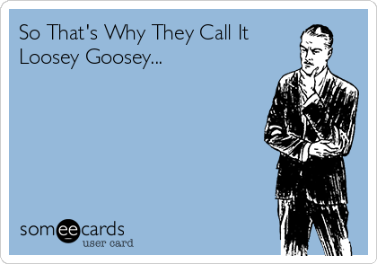

## JavaScript is Loosey-Goosey

For the beginning of my fourth semester of being a Computer Science major in college, I was told that I would have to learn my fourth programming language: JavaScript. "Alright," I thought to myself, "time to start from scratch again." However, I have been pleasantly surprised so far at my level of understanding of the language being that it has only been a week since I started learning it. Perhaps I just got better at learning new languages since I started, or maybe it is the fact that JavaScript is easily understandable, but between learning Java, C, and a tiny bit of C++ (which is not just like programming in C but adding one to the end) I was expecting to feel lost for the first couple weeks of this class, but I feel pretty caught up to speed already.

About the programming language itself, one of the things I noticed immediately is that instead of datatypes such as int, char, float, or sting, etc., the online tutorial told me to type something called "var". After that I was just like "...woah... What?.. So lik-... So what about data types and stuff?... Jeez, I'll never get used to this." The next day, I was blazing through the rest of the tutorial, making vars without hesitation, but now I'd be scared of going back to C and seeing a type disagreement. "var" is a one-size-fits-all data type that even covers this:  []. Yes! A var in itself can be an array! One of the more useful parts about this fact is that now you don't have to dedicate a function to a specific return type, meaning that you can return something like an int or an error message (in the form of a sting) from a single function. I don't like commitment, so just being able to put "function" instead of a return type is helpful. To see what a function looks like in JavaScript, look below.

function isItOne(val) {  // val is the inputted number that we be checked by the function
  var three = 3;         // just here to show what a var definition looks like
  if (val === 1) {
    return 1;            // the function returns 1 if val is 1
  } else {
    return "THAT WASN\'T ONE!"; // the function returns this string is val isn't 1
  }                             // note the \', the \ is to let ' appear in the string
}

Unlike var, there was one important feature that gave me some trouble understanding the first time, which was an object. Conceptually, a JavaScript object is similar to a Java objects or structs in C, however, it could very well be just the formatting of an object that threw me off in JavaScript. I think it would just be easiest to show what an object looks like first, then explain it.

var person = {
  "name": "Bill Billson",
  "age": 5,
  "hobby": "Being Bill",
  12: "is a number"
};

Notice that it is defined like a regular var, where you have "var name = ..." and ends with a ; after the closing bracket. The contents of the object are defined in the curly braces {}. Also, every property of an object is named and defined with a '" ": var' (or can be represented with an number instead of a string, much like an index with an array). There are a couple ways to access properties of an object, such as person.name and person["name"] would both give you "Bill Billson", or person[12] would give you "is a number".

I started learning JavaScript because my teacher for one of my Computer Science classes told me to. He was also the one that told my class that JavaScript was a "loosey-goosey" language. He brought that up because he was showcasing a program that we were making in class and he showed it running, but one student mentioned "hey, there's no semi-colon at the end" and my teacher looked back at the projector screen, looked back at us and responded "that's totally fine." I thought that moment was an interesting example of what JavaScript is like, it's a language that does away with a lot of the complexities and correctness that appears in other languages. Of course, nothaving a semi-colon at the end of a code block is one of the very few syntactical execptions that JavaScript accepts, but a lot of other programming languages don't really have any at all.

It is in that same class that my teacher is also practicing a teaching method called "Athletic Software Development" which is a class structure that really emphasizes practice over anything, treating programming like a pure skill. One of the most important features of athletic software development are these W.O.D.s, or "workout of the day"s. These W.O.D.s are in-class activities where we are given a limited amount of time to create a program that fulfills a certain purpose, this is to exercise (to keep going with this 'athletic' motif) our programming skills. The course also involves many out of class exercises, mostly study material, practice programs, or career-related experiences, and I mention this because, while this is just basically homework like any other class, something is due at least every other day, so there is a lot of homework. Now would I say that I like this style of learning, no, I don't like spending any more time doing schoolwork than I have to, but I hate to admit it, I would probably not like it if I felt like I didn't understand anything either, and this class structure (although is tiring, time-consuming, and stressful at times) I would be lying if I said that it hasn't worked so far. I mean, like I said before, I learned JavaScript surprisingly fast compared to what I was expecting. But just so it's clear, I do NOT like homework.
