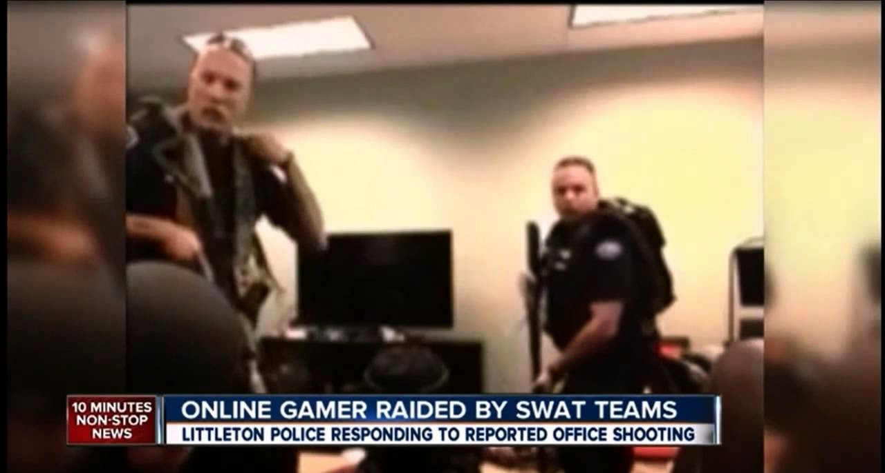

## What am I talking about when I say "ethics"?
  
  Computing technology is becoming more and more integrated in our world today. There are many applications created by programmers that allow people to communicate, transfer large amount of money, and calculate dimensions to build real world objects we rely on. As these programs become more and more important in our lives, we have to make sure that the use of these objects are safe and reliable for everyone to use, since although every program you use would have been made to help you in some way, sometimes vulnerabilities such as a way for someone to find your home address could lead to something horrible, such as harassment, theft, or swatting. However, the ACM (Association for Computing Machinery) has created a [Code of Ethics and Professional Conduct](https://www.acm.org/code-of-ethics). This code is a guideline for programmers, putting them in the mindset to make quality programs that inflict no harm to its users and that also improve the quality of life for people in a society.
  
## How can a leak of personal information inflict harm?

  Computers have the capability to collect, display, and exchange a vast array of information. Many applications we use are online services, these services usually store information about its users. Almost always, a name, email, and password is stored for each user. However, very often, things like your phone number, address, and credit card information are also put on their online service, just think of what kind of information you have to give when ordering something online. Some people are able to get a handle of information like this, without anyone noticing, and abuse it. For example, there is a popular website that allows people to watch other people play games, this website is called Twitch. If you are unfamiliar with this concept, its appeal may seem foreign to you, I can try to explain as someone who loves to play video games, imagine you are engaging in your hobby and playing video games with your friends, you also have people watching you have fun. There is also a live chat feature that allows the streamer see what the fans want to say and the streamer can respond to them in real time, such as answering something the fans are curious about or laughing at a funny joke they make. As a viewer, you can talk to these streamers in this way and you can even donate or subscribe to them, giving them money in a single instance, or paying them over a period of time and getting some benefits because of it (such as access to use emotes from that streamer on Twitch). As a streamer, you can have a dream job, playing games, having fun, being adored by many, and being paid by fans wanting to support you. I am no streamer, but I am interested in it since I do love playing video games myself, however, there is a scary reality for these streamers. If many people have their eye on you, you could get targeted by hackers and have your personal information found and exposed. Some (or I could say many) streamers have had this happen to them, in which they were harassed by people and even swatted. Swatting is the the act of calling a SWAT team, alerting them of a highly dangerous situation, to the address of a streamer's home. A SWAT team promptly goes to that location, busts down the door and holds the people in the house at gunpoint, even though there is no real danger in the situation. This is possible when a harasser gets a hold of that streamer's personal information like their address. However, this is not all Twitch's fault, the unauthorized leak of one's personal information is a process that can span across many different online services.
  
## How Obnoxious did it

  An article from the New York Times, ["The Serial Swatter"](https://www.nytimes.com/2015/11/29/magazine/the-serial-swatter.html) depicted one of this very thing. A person of the screen name Obnoxious has harassed many female Twitch streamers, by endlessly sending threatening messages to their phone, calling them, sending pizza (very unappetizing sorts) to the streamers' addresses, and worst of all, calling SWAT teams to their houses. Obnoxious was able to do all of this because he was able to get those streamer's personal information and he also put this information out online, for the rest of the public to see, a practice called doxing. These Twitch streamers really enjoyed using the website, however, them using it has put their lives in danger. Obnoxious talked to his victims, saying that he wanted to make friends, but used threats in order to keep them from ignoring him, and even revealed his method of getting their personal information in conversation with one of them. Many times, he would have gotten this information through calling online companies and tricking thye customer service to give him information, and a lot of times, he would just need an answer to a security question, like the name of your first pet, to get information like this. He would collect information by doing the same to different companies in order to get more information. For example, he said that he would call Amazon, and that he was the streamer and forgot their password but knows their birthday, and if the Amazon worker gave it to him, he could take over their account, but if they didn't, he could just call again. Eventually, Obnoxious was caught by the police after a long investigation from the efforts of a single man, B.A. Finley, who estimated that he worked roughly 1,000 hours on the case. Finding the harasser was made complicated since he made himself hard to track by using VPNs 9virtual private networks) that made his I.P. address and therefore, his location, difficult to track. But also, Finley was able to track him down eventually since Obnoxious himself had been doxed, but he found that he lived in Canada, making it extremely difficult to make an arrest. Initially, Canada wasn't interested in making the arrest, but eventually carried out the arrest after he swatted even more streamers.
  
  

  
## What does this have to do with ethics and how can we fix it with ethics?

  Some of the principles in the ACM's code of ethics that have been violated in this situation are 1.2, Avoid harm, 1.6, Respect privacy, 2.9, Design and implement systems that are robustly and usably secure. However, this violation is very complicated since it wasn't Twitch that was the source that Obnoxious got the streamers' personal information. Also, these harassers were able to call the SWAT team to innocent people's home by taking advantage of their high alert and quick response method of dealing with situations, they are called hearing that someone at a streamer's address has a weapon and has been shooting innocent people and ready to fight back. If the SWAT team choose to not respond at a high state of alert, what would happen in a real emergency situation? A possible solution is to have a stricter policy for people operating phones for online services, however, this policy will have to be carried out for all online services, since any vulnerable source of information can be taken advantage of by a dedicated harasser. Twitch can also make a more prevalent effort to educate streamers on how to protect their personal information, since even slight carelessness can lead to your house being swatted, especially when considering that the footage is being broadcasted live, thousands of people can watch everything that you are doing in real time. If they do make efforts to educate their streamers, they would be following the guideline 2.7 of the ACM's code of ethics, Foster public awareness and understanding of computing, related technologies, and their consequences. Even though this is a partial solution, it is not foolproof, if Twitch did this, they would still be leaving the streamer's security in their own hands rather than making their service and related ones completely secure.
