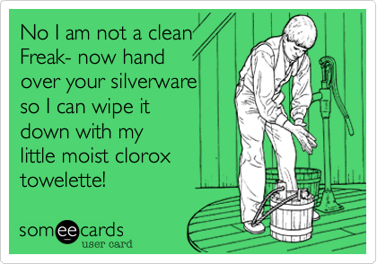

  <link rel="stylesheet" href="https://cdnjs.cloudflare.com/ajax/libs/semantic-ui/2.4.1/semantic.min.css">
  <script type="text/javascript" src="https://cdnjs.cloudflare.com/ajax/libs/jquery/3.3.1/jquery.min.js"></script>
  <script type="text/javascript" src="https://cdnjs.cloudflare.com/ajax/libs/semantic-ui/2.4.1/semantic.min.js"></script>



## Being introduced to Semantic UI

  Recnetly, I have been dipping my toes back into HTML in my software engineering class. The last time I have programmed in HTML was in high school so it has been a while since I have done much with it and I realized that I have forgot a lot about it. Ever since my college career started I have learned Java, C, and JavaScript and compared to those languages HTML is very different. HTML is a language that mostly serves to buld the user interface for websites and the syntax is very different. Either way, I seem to have gotten my old groove back and everything seemed to have come back to me. It has been super fun too. Since I knew how fun it was to make websites in which I can customize the aesthetic and organization and making these kinds of project again reminded of why I thought coding was cool in the first place. Sure, learning algorithms, functions, and how to make them efficient is cool and everything but making a website that has content is very refreshing. And since I have so much fun trying to get my websites to look good, I came across Semantic UI. It is a framework that allows you to create or modify HTML elements and content structures using prebuilt-definitions. 
  
### How Semantic UI works

   First, if you are concerned with installing Semantic UI, you don't have to worry, you don't need to install anything! You can simply link your HTML code to the framework by putting in the following links into the head section of your HTML files:
```
  <link rel="stylesheet" href="https://cdnjs.cloudflare.com/ajax/libs/semantic-ui/2.4.1/semantic.min.css">
  <script type="text/javascript" src="https://cdnjs.cloudflare.com/ajax/libs/jquery/3.3.1/jquery.min.js"></script>
  <script type="text/javascript" src="https://cdnjs.cloudflare.com/ajax/libs/semantic-ui/2.4.1/semantic.min.js"></script>
```
Now you're all set to use Semantic UI!

  The general idea of Semantic UI is that Semantic UI has HTML style classes that have predetermined definitions. When you create an object, you can set the class of that element to have it posess certain characteristics or take certain forms. There are many examples of what kinds of modifications you can do to an element, and if you're curious about all of them you can check out their website, <a href="https://semantic-ui.com/">https://semantic-ui.com/</a>, where it shows you a whole bunch of element types and collection forms you can create with it (under the "Menu" button).
  
  An example of its use can be as follows, we are using a button, in order to format it into the Semantic UI ctyle, we can say:
```
  <button class="ui button">
    Button
  </button>
```
If we want it to be a like button, with a heart icon and a label, we can do the following: (the results of this code can be found on the official website, <a href="https://semantic-ui.com/elements/button.html#labeled">labeled button</a>)
```
<div class="ui labeled button">
  <div class="ui button">
    <i class="heart icon"></i> Like
  </div>
  <a class="ui basic label">
    2,048
  </a>
</div>
```
  As you can see, it will no longer take much effort in order to change the look of an element of your website to look more refined. Semantic's predefined element classes make the element look more impressive, and you can even combine it with other classes in order to change the look as you caw witht he like button. However, these are all presets, and you it isn't likely that these presets are always going to fit how you intend these elements to work.
