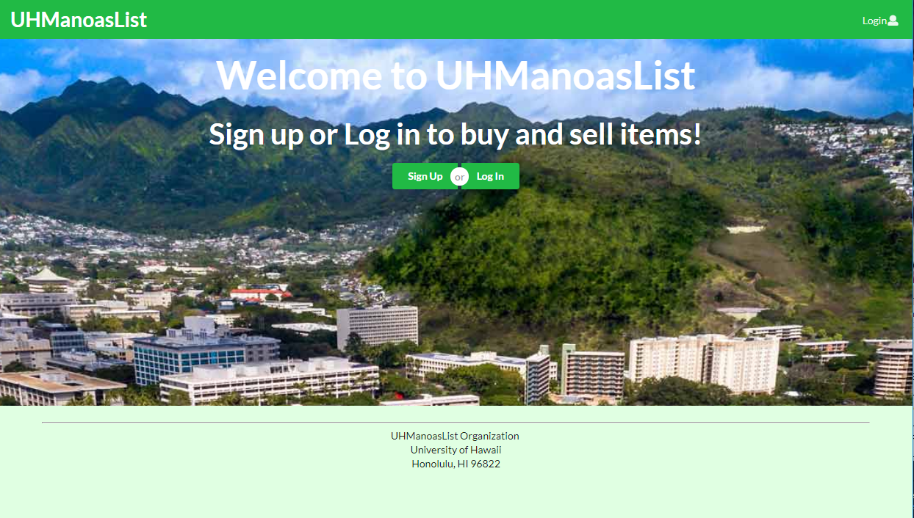

  This semester (Spring 2019), in my software engineering class, we had to do a final project. For this project, we had to create a website. We were assigned this project in groups of four, and my group was tasked with making a "Manoa Flea Market", where we make a service much like that of Craigslist, where you can put items up for sale online and you can buy people's listing by meeting the seller in person, except we made a similar service specifically for the use of students of UH Manoa. 
 
  In order to complete this project, we used issue-oriented development, where we accomplish development tasks based on what is needed to be completed at the time. I played a relatively active role in the development of this project, and if you would like to see the home page for the application, you can click the link below. It includes links to the website itself as well as github pages outlining the development process.
